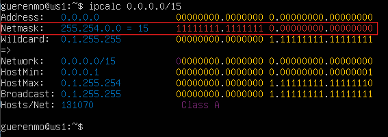
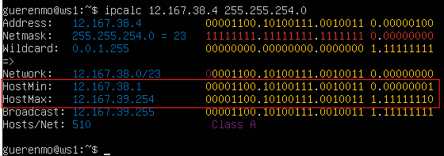
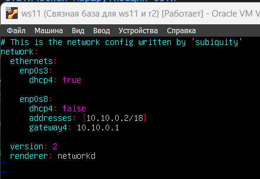
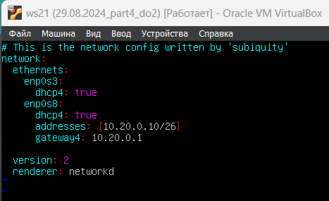
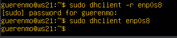
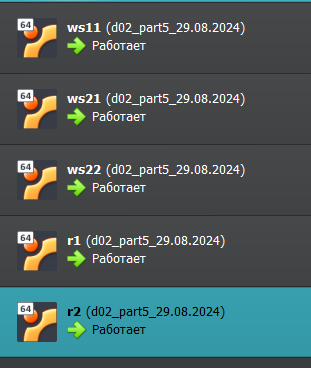
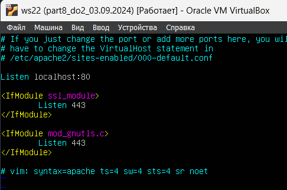

# Сети в Linux

`// made by guerenmo // да пребудет с нами линукс` 

Настройка сетей в Linux на виртуальных машинах.

## Разделы
1. [Инструмент ipcalc](#part-1-инструмент-ipcalc) 
2. [Статическая маршрутизация между двумя машинами](#part-2-статическая-маршрутизация-между-двумя-машинами)  
3. [Утилита iperf3](#part-3-утилита-iperf3)   
4. [Сетевой экран](#part-4-сетевой-экран)  
5. [Статическая маршрутизация сети](#part-5-статическая-маршрутизация-сети)  
6. [Динамическая настройка IP с помощью DHCP](#part-6-динамическая-настройка-ip-с-помощью-dhcp)  
7. [NAT](#part-7-nat)  
8. [Допополнительно. Знакомство с SSH Tunnels](#part-8-дополнительно-знакомство-с-ssh-tunnels)   

## Part 1. Инструмент ipcalc

**1.1. Сети и маски**

* Определен адрес сети с помощью команды `ipcalc` - `192.160.0.0`

    

* Переведена маска `255.255.255.0` в префиксную и двоичную запись

    

    * В двоичной записи - `11111111.11111111.11111111.00000000`
    * В префиксной - `24`

* Переведена маска `/15` в обычную и двоичную запись

    

    * В двоичной записи - `11111111.11111110.00000000.00000000`
    * В обычной - `255.254.0.0`

* Маску `11111111.11111111.11111111.11110000` в такой форме `ipcalc` не может принять, поэтому обычная форма записи маски рассчитывалась вручную

    

    * Обычная форма записи маски - `255.255.255.240`

    * Префиксная форма записи маски - `28`

    

* Определен максимальный и минимальный хост в сети `12.167.38.4` при маске `/8`

    

    * Минимальный хост - `12.0.0.1`

    * Максимальный хост - `12.255.255.254`

* Определен максимальный и минимальный хост в сети `12.167.38.4` при маске `11111111.11111111.00000000.00000000`

    

    * Минимальный хост - `12.167.0.1`

    * Максимальный хост - `12.167.255.254`

* Определен максимальный и минимальный хост в сети `12.167.38.4` при маске `255.255.254.0`

    

    * Минимальный хост - `12.167.38.1`

    * Максимальный хост - `12.167.39.254`

* Определен максимальный и минимальный хост в сети `12.167.38.4` при маске `/4`

    

    * Минимальный хост - `0.0.0.1`

    * Максимальный хост - `15.255.255.254`

**1.2. localhost**

* Для начала определим ip-адрес, связанный с localhost

    

    Адрес относится к диапазону `127.0.0.0` - `127.255.255.255`, который зарезервирован для петлевых интерфейсов (loopback)

    * `194.34.23.100` - к приложению невозможно обратиться

    * `127.0.0.2` - обращение возможно

    * `127.1.0.1`- обращение возможно

    * `128.0.0.1`- к приложению невозможно обратиться

**1.3. Диапазоны и сегменты сетей**

* Существует разделение IP-адресов на `«частные»` и `«публичные»`. Под частные (локальные) сети зарезервированы следующие диапазоны адресов:

    * 10.0.0.0 - 10.255.255.255 (10.0.0.0/8);

    * 172.16.0.0 - 172.31.255.255 (172.16.0.0/12);

    * 192.168.0.0 — 192.168.255.255 (192.168.0.0/16);

    * 127.0.0.0 — 127.255.255.255 (зарезервировано для петлевых интерфейсов (не используется для обмена между узлами сети), т. н. localhost).

* Все остальные адреса используются как публичные

* IP-адреса, которые можно использовать в качестве частного (локального):

    * 10.0.0.45

    * 192.168.4.2

    * 172.20.250.4

    * 172.16.255.255

    * 10.10.10.10

* IP-адреса, которые можно использовать в качестве публичного:

    * 134.43.0.2

    * 172.0.2.1

    * 192.172.0.1

    * 172.68.0.2

    * 192.169.168.1

* Для сети `10.10.0.0/18` диапазон адресов составляет `10.10.0.1` - `10.10.63.254`

    

* IP-адреса, которые могут быть шлюзом:

    * 10.10.0.2

    * 10.10.10.10

    * 10.10.1.255

* IP-адреса, которые не подходят:

    * 10.0.0.1

    * 10.10.100.1

## Part 2. Статическая маршрутизация между двумя машинами

* Подключил дополнительные сетевые интерфейсы в настройках виртуальных машин

    * для первой (ws1)

        

    * для второй (ws2)

        

* Вывод текущих сетевых интерфейсов командой `ip a` на `ws1`

    

* Вывод текущих сетевых интерфейсов командой `ip a` на `ws2`

    

* Описал сетевой интерфейс внутренней сети на `ws1`

    

* Проверил новые настройки на корректность и перезапустил сервис сети на `ws1`. Для интерфейса внутренней сети `enp0s8` установлен ip-адрес `192.168.100.10/16`

    

* Описал сетевой интерфейс внутренней сети на `ws2`

    

* Проверил новые настройки на корректность и перезапустил сервис сети на `ws1`. Для интерфейса внутренней сети `enp0s8` установлен ip-адрес `192.168.100.10/16`

    

**2.1. Добавление статического маршрута вручную**

* Добавил статический маршрут от ws1 до ws2 командой `ip r add [адрес подключения] dev [имя сети]`

    

* Добавил статический маршрут от ws2 до ws1

    

* Результат команды `ping` для проверки соединения от ws1 до ws2

    

* Результат команды `ping` для проверки соединения от ws2 до ws1

    

* Можно отметить везде строчку `0% packet loss`, это означает что соединение установлено `успешно`

**2.2. Добавление статического маршрута с сохранением**

* После перезагрузки обеих машин статических маршрут не сохранился

    * Попытка пропинговать соединение от ws1 до ws2

        

    * Попытка пропинговать соединение от ws2 до ws1

        

* Изменил настройки в файле `/etc/netplan/00-installer-config.yaml`, добавил в параметр `routes` интерфейса `enp0s8` ip-адреса машин. Данный параметр позволяет добавить статические маршруты от одной машины к другой

    * Файл `/etc/netplan/00-installer-config.yaml` на `ws1`

        

    * Проверил новые настройки на корректность и перезапустил сервис сети на `ws1`

        

    * Файл `/etc/netplan/00-installer-config.yaml` на `ws2`

        

     * Проверил новые настройки на корректность и перезапустил сервис сети на `ws2`

        

* Проверил соединение обеих машин через команду `ping`

    * Результат команды `ping` для проверки соединения от ws1 до ws2

    

    * Результат команды `ping` для проверки соединения от ws2 до ws1

    

* Можно отметить везде строчку `0% packet loss`, это означает что соединение установлено `успешно` и правильно заданы настройки в файле `/etc/netplan/00-installer-config.yaml` на обеих машинах

## Part 3. Утилита iperf3

**3.1. Скорость соединения**

* Перевод единиц измерений скорости соединения

    * 8 Mbps в MB/s -> 8 Mbps (Мбит/с) = 8 / 8 = 1 MB/s (МБ/с)

    * 100 MB/s в Kbps -> 100 MB/s (МБ/с) = 100 * 8 * 1 000 = 800 000 Kbps (Кбит/с)

    * 1 Gbps в Mbps -> 1 Gbps (Гбит/с) = 1 * 1 000 = 1 000 Mbps (Мбит/с)

**3.2. Утилита iperf3**

* Включил ws1 в режиме сервера командой `iperf3 -s -f K` (опция `-f K` позволит отобразить скорость соединения в Кбайтах)

* Включил ws2 в режиме клиента командой `iperf3 -c 192.168.100.10 -f K` (опция `-f K` позволит отобразить скорость соединения в Кбайтах)

* Вывод команды `iperf3` на ws2 `(клиент)`

    

* Вывод команды `iperf3` на ws1 `(сервер)`

    

## Part 4. Сетевой экран

**Утилита iptables**

* Создал файл `/etc/firewall.sh`, который имитирует работу фаервола, на ws1 и на ws2

* Содержимое файла на ws1

    

* Содержимое файла на ws2

    

* В файл добавил следующие правила:

    * Открыл на машинах доступ для порта 22 (ssh) и порта 80 (http) командой `iptables -A INPUT -p tcp --dport 22 -j ACCEPT` и `iptables -A INPUT -p tcp --dport 80 -j ACCEPT`

        **// пояснение //**
        
        * параметр `-A INPUT` говорит об обработке входящих пакетов,
        * `-p tcp` указывает на пакеты протокола `tcp`, 
        * `--dport 22` и `--dport 80` указывает входящий порт, к которому применяется правило,
        * `-j ACCEPT` говорит о том, что все пакеты, соответствующие правилу, проходят через фаервол.

    * Запретил `echo reply` командой `iptables -A OUTPUT -p ICMP --icmp-type echo-reply -j DROP`

        **// пояснение //**
        
        * параметр `-A OUTPUT` говорит об обработке исходящих пакетов,
        * `-p ICMP` указывает на протокол `ICMP`, 
        * `--icmp-type echo-reply` указывает на тип сообщения `echo-reply`,
        * `-j DROP` запрещает отправлять такие пакеты.

    * Разрешил `echo reply` командой `iptables -A OUTPUT -p ICMP --icmp-type echo-reply -j ACCEPT`

        * Аналогично с предыдущим пунктом, параметр `-j ACCEPT` разрешает отправлять сообщения типа `echo-reply`

    * Содержимое файла `/etc/firewall.sh` на ws1

        

    * Содержимое файла `/etc/firewall.sh` на ws2

        

    * Запустил файл командами `chmod +x /etc/firewall.sh` и `/etc/firewall.sh` на ws1

        

    * Запустил файл командами `chmod +x /etc/firewall.sh` и `/etc/firewall.sh` на ws2

        

    * Разница между двумя стратегиями состоит в том, что срабатывает первое написанное правило. Первое правило у ws2 разрешает отвечать на пинг запросы, а запрещающее правило написанное после не срабатывает. Первое правило имеет приоритет, аналогично в ws1, где первым идет запрещающее правило из-за которого мы не получим ответ на пинг

**Утилита nmap**

* Результат команды `ping` для проверки соединения от ws1 до ws2

    

* Результат команды `ping` для проверки соединения от ws2 до ws1

    

* Машина ws1 не пингуется после запуска файла `etc/firewall.sh`

* Результат команды `nmap` на проверку хоста ws1 - хост машины запущен (Host is up)

    

## Part 5. Статическая маршрутизация сети

* Схема сети 

    

    Далее порты `eth0` и `eth1` буду обозначаться соответственно как `enp0s8` и `enp0s9`

* Поднято 5 виртуальных машин (3 рабочие станции (ws11, ws21, ws22) и 2 роутера (r1, r2))

    

**Настройка адресов машин**

* Настроена конфигурация сети машин в `etc/netplan/00-installer-config.yaml`

    * для ws11

        

    * для ws21

        

    * для ws22

        

    * для r1

        

    * для r2

        

* После перезапуска сервиса сети (команда `sudo netplan apply`) командой `ip -4 a` проверил корректность установленых настроек на каждой машине

    * для ws11

        

        Для интерфейса `enp0s8` установлен ip-адрес `10.10.0.2/18`

    * для ws21

        

        Для интерфейса `enp0s8` установлен ip-адрес `10.20.0.10/26`

    * для ws22

        

        Для интерфейса `enp0s8` установлен ip-адрес `10.20.0.20/26`

    * для r1

        

        Для интерфейса `enp0s8` установлен ip-адрес `10.10.0.1/18`

        Для интерфейса `enp0s9` установлен ip-адрес `10.100.0.11/16`

    * для r2

        

        Для интерфейса `enp0s8` установлен ip-адрес `10.100.0.12/16`

        Для интерфейса `enp0s9` установлен ip-адрес `10.20.0.1/26`

* Проверил соединение ws22 с ws21 командой `ping`

    

* Проверил соединение r1 с ws11 командой `ping`

    

**Включение переадресации IP-адресов**

* Для включения переадресации IP выполнил команду `sysctl -w net.ipv4.ip_forward=1` на роутерах

    * на r1

        

    * на r2

        

* Открыл файл `/etc/sysctl.conf` и добавил в него строку `net.ipv4.ip_forward = 1` для постоянной переадресации

    * на r1

        

    * на r2

        

**Установка маршрута по умолчанию**

* Пример вывода команды `ip r` после добавления шлюза (то что я сделаю в следующих пунктах)

    ```
    default via 10.10.0.1 dev eth0
    10.10.0.0/18 dev eth0 proto kernel scope link src 10.10.0.2
    ```
* Добавил в файле конфигураций маршрут по умолчанию (шлюз) - добавил `default` перед IP-роутера

    * для ws11

        

    * для ws21

        

    * для ws22

        

* Командой `ip r` проверил наличие маршрута в таблице маршрутизации

    * на ws11

        

    * на ws21

        

    * на ws22

        

* Пропинговал с ws11 роутер r2

    

* Применил команду `tcpdump -tn -i enp0s8` на r2

    

    Из скринов видно, что пинг доходит, но ответа нет

**Добавление статических маршрутов**

* Добавил в роутеры r1 и r2 статические маршруты в файле конфигураций

    * для r1

        

        в конце описания интерфейса `enp0s9` добавил
        ```
        - to: 10.20.0.0/26
          via: 10.100.0.12
        ```

    * для r2

        

        в конце описания интерфейса `enp0s8` добавил
        ```
        - to: 10.10.0.0/18
          via: 10.100.0.11
        ```

* Вызвал `ip r` и вывел таблицы с маршрутами на каждом роутере

    * Пример таблицы на r1
    
        ```
        10.100.0.0/16 dev eth1 proto kernel scope link src 10.100.0.11
        10.20.0.0/26 via 10.100.0.12 dev eth1
        10.10.0.0/18 dev eth0 proto kernel scope link src 10.10.0.1
        ```
    * Вывод команды `ip r` на r1

        

    * Вывод команды `ip r` на r2

        

* Запустил команды `ip r list 10.10.0.0/18` и `ip r list 0.0.0.0/0` на ws11

    

* Маршруты с более конкретными префиксами (длинными масками сети) имеют приоритет над более общими маршрутами. Когда Linux определяет маршрут для IP-адреса, он сначала пытается найти самый конкретный маршрут (с самой длинной маской сети). Для IP-адресов, которые подпадают под более конкретные маршруты (такие как 10.10.0.0/18), всегда выбирается этот маршрут, а не маршрут по умолчанию (0.0.0.0/0).

**Построение списка маршрутизаторов**

* Запустил команду дампа `tcpdump -tnv -i enp0s8` на r1

    

* Вывод команды

    

* Построил список маршрутизаторов на пути от ws11 до ws21 командой `traceroute`

    

* Утилита `traceroute` отправляет последовательность пакетов к целевому хосту с постепенно увеличивающимся значением поля TTL (Time To Live). TTL — это поле в заголовке IP-пакета, которое указывает максимальное количество промежуточных маршрутизаторов, через которые пакет может пройти. Каждый раз, когда пакет проходит через маршрутизатор, значение TTL уменьшается на единицу. Когда TTL достигает нуля, маршрутизатор отбрасывает пакет и отправляет обратно ICMP сообщение "Time Exceeded" к отправителю.

    **Анализ дампа на r1**

* На предоставленном скриншоте видно, что `tcpdump` на маршрутизаторе r1 перехватывает различные пакеты, включая те, которые связаны с запросами ICMP и UDP от утилиты traceroute.

* `unreachable` - эти сообщения возникают, когда маршрутизатор на пути не может доставить пакет к конечному пункту назначения, либо из-за того, что TTL пакета истек, либо из-за того, что целевой порт недоступен. Эти сообщения отправляются обратно к отправителю, и traceroute регистрирует IP-адрес маршрутизатора, который отправил это сообщение, как один из узлов на пути.

* Эти данные позволяют нам увидеть, какие маршрутизаторы находятся на пути между нашим компьютером и удаленным хостом, и какие узлы отвечают за пересылку трафика на данном маршруте.

* Пакеты сначала проходят через маршрутизатор `r1 (IP 10.10.0.1)`, затем через `r2 (IP 10.100.0.12)`, и, наконец, достигают `ws21 (IP 10.20.0.10)`.

**Использование протокола ICMP при маршрутизации**

* Запустил на r1 перехват сетевого трафика, проходящего через `enp0s8` с помощью команды `tcpdump -n -i enp0s8 icmp`

    

* Пропинговал с ws11 несуществующий IP `10.30.0.111` командой `ping -c 1 10.30.0.111`

    

* Вывод команды `tcpdump -n -i enp0s8 icmp` на r1

    

    Роутер получил пакет для адреса `10.30.0.111`, но не может этот адрес определить в сети. Поэтому в следующей строке сообщает об ошибке.

## Part 6. Динамическая настройка IP с помощью DHCP

* Для r2 настроил в файле `/etc/dhcp/dhcpd.conf` конфигурацию службы DHCP

    * Указал адрес маршрутизатора по умолчанию, DNS-сервер и адрес внутренней сети

        

    * В файле resolv.conf прописал nameserver 8.8.8.8

        

* Перезапустил службу DHCP командой `systemctl restart isc-dhcp-server` на r2

    

* Перезапустил ws21 командой `sudo reboot` и запустил команду `ip a`, чтобы показать, что ws21 получила адрес

    

* Пропинговал ws22 с ws21

    

* Указал MAC-адрес машине ws11, добавив строки `macaddress: 10:10:10:10:10:BA` и `dhcp4: true`

    

* Настроил службу DHCP для r1 аналогично r2, но сделал выдачу адресов с жесткой привязкой к MAC-адресу (ws11)

    * Содержимое файла `/etc/dhcp/dhcpd.conf` на r1

        

    * В файле resolv.conf прописал nameserver 8.8.8.8

        

* Перезапустил службу DHCP командой `systemctl restart isc-dhcp-server` на r1

    

* Перезапустил ws11 командой `sudo reboot` и запустил команду `ip a`, чтобы показать, что ws11 получила адрес

    

* Пропинговал ws11 с ws22

    

* Вызвал команду `ip a` на ws21 для того, чтобы показать IP-адрес до принудительного обновления через клиента DHCP (dhclient)

    

* Обновил IP-адрес для `enp0s8` на ws21 следующими командами

    * `sudo dhclient -r enp0s8` для освобождения текущего адреса
    * `sudo dhclient enp0s8` для получения нового адреса

        

* Повторно вызвал команду `ip a` на ws21, чтобы показать новый IP-адрес

     

* Пояснение к использованным опциям в `/etc/dhcp/dhcpd.conf`

    * `range [начало диапазона]` `[конец диапазона]`; - Задает диапазон IP-адресов, которые DHCP-сервер может выдать клиентам.
    * `option routers` задает шлюз по умолчанию, который будет использоваться клиентом для выхода в другие сети.
    * `option domain-name-servers` указывает DNS-серверы, которые будут использоваться клиентом для разрешения доменных имен

## Part 7. NAT

* В задании использовались машины из [Part 5](#part-5-статическая-маршрутизация-сети)

    

* В файле `/etc/apache2/ports.conf` на ws22 и r1 изменил строку `Listen 80` на `Listen 0.0.0.0:80`

    * Содержимое файла на ws22

        

    * Содержимое файла на r1

        

* Запустил веб-сервер Apache командой `service apache2 start`

    * на ws22

        

    * на r1

        

* Добавил в фаервол, созданный по аналогии с фаерволом из [Part 4](#part-4-сетевой-экран), на r2 следующие правила:

    * Удаление правил в таблице filter — `iptables -F`;

    * Удаление правил в таблице «NAT» — `iptables -F -t nat`;

    * Отбрасывать все маршрутизируемые пакеты — `iptables --policy FORWARD DROP`.

        

* Запустил файл по аналогии с [Part 4](#part-4-сетевой-экран)

    

* Проверил соединение между ws22 и r1 командой `ping`

    

    ws22 `не пингуется` с r1

* Добавил в фаервол на r2 еще одно правило - разрешение маршрутизации всех пакетов протокола ICMP

    

* Запустил файл

    

* Проверил соединение между ws22 и r1 командой `ping`

    

    Теперь ws22 `пингуется` с r1

* Добавил в файл фаервола на r2 правила для SNAT и DNAT

    

     **// пояснение //**

     **SNAT** позволяет изменить адрес и порт отправителя пакета после маршрутизации. **DNAT** работает аналогично, но изменяет адрес и порт получателя и делает это до маршрутизации.

     **Теперь по правилам**

    * Первое правило говорит о том, что для пакетов с протоколом **tcp**, отправленных из подсети **10.20.0.0/26**, адрес отправителя меняется на **10.100.0.12** (адрес роутера r2).

    * Второе правило аналогичное с небольшими отличиями, теперь при обращении к **10.100.0.12** с указанием **8080** порта пакеты перенаправляются на **10.20.0.20:80** (на ws22 с портом 80).

    * Опция `-o enp0s8` говорит о том, что правило работает для пакетов, которые отправляются с интерфейса `enp0s8`. Аналогично с `-i enp0s8`, здесь мы работаем только с теми пакетами, которые пришли на интерфейс `enp0s8`.

    * Последние два правила нужны для настройки маршрутизации двух интерфейсов на роутере r2, правила позволяют интерфейсам `enp0s8` и `enp0s9` пересылать пакеты между собой.

* Файл сохранен и запущен

    

* **Перед тестированием отключил сетевые порты NAT в VirtualBox**

* Проверил соединение по TCP для SNAT, для этого с ws22 подключился к серверу Apache на r1 командой `telnet 10.10.0.1 80`

    

* Проверил соединение по TCP для DNAT, для этого с r1 подключился к серверу Apache на ws22 командой `telnet 10.100.0.12 8080`

    

## Part 8. Дополнительно. Знакомство с SSH Tunnels

* Запустил фаервол с правилами из [Part 7](#part-7-nat)

    

* Изменил строку `Listen 80` на `Listen localhost:80` для запуска веб-сервера Apache на localhost на ws22

    

    `// пометка //` скрин был сделан после всех манипуляций, так как забыл его сделать

* Установил соединение ws21 и ws22 через `Local TCP forwarding`

    

    * команда `ssh -p 2022 -L 9999:localhost:80 guerenmo@10.20.0.20` устанавливает соединение  через SSH-сервер с ws22 и позволяет обратиться к 80 порту этой машины по локальному порту 9999 машины ws21.

* Установил соединение ws22 и ws11 через `Remote TCP forwarding`

    

    * команда `ssh -p 2022 -R 8888:localhost:80 guerenmo@10.10.0.2` аналогична предыдущей команде, но перенаправляет трафик с удаленного сервера на локальную машину через SSH-сервер. При обращении к порту 8888 на ws11 мы получаем доступ к порту 80 на ws22.

* Проверил подключение ws22 и ws21 - соединение установлено и работает стабильно

    

* Проверил подключение ws22 и ws11 - соединение установлено и работает стабильно

    

**сети...порты...роутеры...наконец все это закончилось**

**зато теперь есть понимание как все работает в ваших сетях**

**вот тебе котика на последок**


